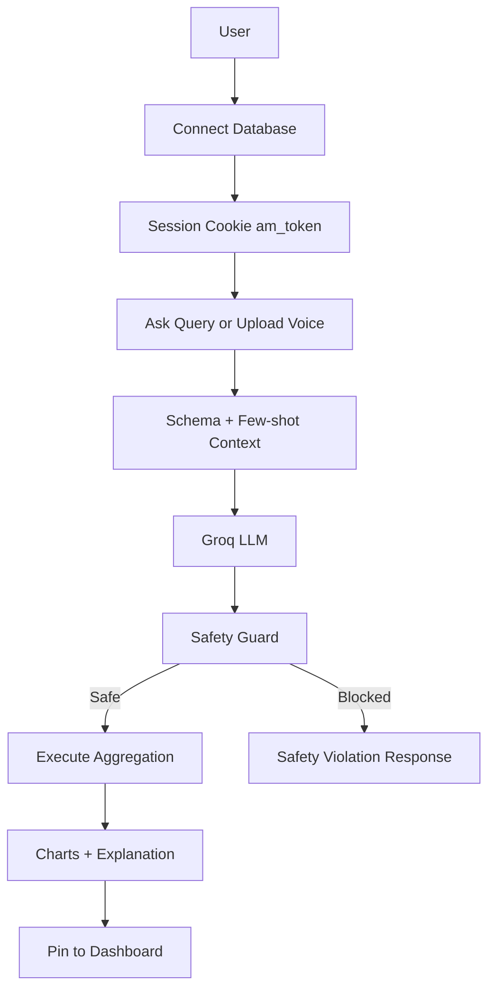

<div align="center">
  

  <h1>AtlasMind</h1>
  <p><strong>Talk to your data. Get production-ready insights in seconds.</strong></p>

  <p>
    <a href="https://atlasmind19.netlify.app/"><strong>Live Demo</strong></a>
  </p>

  <p>
    
    
    
  </p>
</div>

---

## Why AtlasMind

AtlasMind is a conversational BI platform for MongoDB that combines:

- Natural language analytics
- Voice-to-insight pipelines
- Read-only safety enforcement
- Fast chart-first exploration

You ask a question in plain English. AtlasMind profiles schema context, generates aggregation logic, validates it for safety, executes the query, and returns a visual answer with explanation.

---

## Tech Stack (Shields)

### Frontend


### Backend


### AI and Speech


### DevOps and CI


---

## What Makes It Different

- Schema-aware prompting: generated pipelines are grounded in profiled collection/field metadata.
- Safety-first query execution: blocked stages/operators are rejected before execution.
- Session-based security: httpOnly JWT cookie for protected analytics routes.
- Voice-to-query support: upload audio and get chartable results in one flow.
- Persistent dashboard pins: save and refresh important query snapshots.

---

## Architecture Snapshot



---

## Quick Start

### 1) Install

```bash
git clone https://github.com/lakshmanbhukya/AtlasMind.git
cd AtlasMind

cd server && npm install
cd ../client && npm install
```

### 2) Configure server environment

Create server/.env:

```env
MONGODB_URI=mongodb+srv://<username>:<password>@<cluster>.mongodb.net/<metadata_db>
GROQ_API_KEY=your-groq-api-key
JWT_SECRET=your-long-random-secret
ENCRYPTION_KEY=64_hex_chars_for_aes_256
PORT=3001
NODE_ENV=development
```

### 3) Run

Windows shortcut:

```bash
start.bat
```

Manual:

```bash
cd server && npm run dev
cd client && npm run dev
```

Open http://localhost:5173

---

## Documentation Portal

| Guide                                        | Purpose                                      |
| -------------------------------------------- | -------------------------------------------- |
| [Architecture](./docs/ARCHITECTURE.md)       | System design, flows, and technical patterns |
| [Setup](./docs/SETUP.md)                     | Local installation and configuration         |
| [Features](./docs/FEATURES.md)               | Product capabilities and usage ideas         |
| [API](./docs/API.md)                         | Endpoint contracts and response shapes       |
| [Development](./docs/DEVELOPMENT.md)         | Workflow, tests, and conventions             |
| [Deployment](./docs/DEPLOYMENT.md)           | Netlify + Render deployment path             |
| [Troubleshooting](./docs/TROUBLESHOOTING.md) | Common failures and fixes                    |

---

## CI, Docker, and Release

GitHub Actions workflow at .github/workflows/ci.yml:

- Tests server
- Builds client
- Builds and pushes server/client Docker images on main

Required GitHub secrets:

- DISCORD_WEBHOOK
- DOCKERHUB_USERNAME
- DOCKERHUB_TOKEN

Manual Docker build examples:

```bash
docker build -t your-username/atlasmind-server ./server
docker build -t your-username/atlasmind-client ./client
```

---

## Author

Lakshman Bhukya  
Full-Stack Developer and AI Enthusiast

[](https://github.com/lakshmanbhukya)

---

<div align="center">
  
</div>
