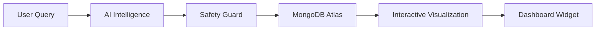

<div align="center">
  
  <h1>🚀 AtlasMind</h1>
  <p><b>Talk to your data. AI-Powered Conversational BI for MongoDB.</b></p>
  
  <p>
    <a href="https://atlasmind19.netlify.app/"><b>🌐 Live Demo</b></a> • <br><br>
    
    
    
  </p>
</div>

---

## 🔍 Overview

**AtlasMind** is a state-of-the-art conversational BI platform that transforms natural language into complex MongoDB queries (MQL). Built with **React**, **Node.js**, and **Groq's ultra-fast LPU inference**, it empowers anyone—from developers to business users—to explore datasets, generate visualizations, and build live dashboards through simple conversation.

---

## 🧭 Documentation Portal

To keep things organized, our documentation is split into several focused guides:

| Guide | Description |
|---|---|
| 🏗️ **[Architecture](./docs/ARCHITECTURE.md)** | System design, AI pipeline flowcharts (Mermaid), and tech stack. |
| ⚙️ **[Setup Guide](./docs/SETUP.md)** | Step-by-step installation, env variables, and quick start. |
| 🌟 **[Features & Usage](./docs/FEATURES.md)** | Key features, query patterns, and example asks. |
| 📡 **[API Reference](./docs/API.md)** | Endpoint definitions and request/response examples. |
| 📄 **[Development](./docs/DEVELOPMENT.md)** | Project structure, testing strategies, and roadmap. |
| 🚀 **[Deployment](./docs/DEPLOYMENT.md)** | Manual deployment to Netlify (Frontend) and Render (Backend). |
| 🔧 **[Troubleshooting](./docs/TROUBLESHOOTING.md)** | Common issues, 429 errors, and connection fixes. |

---

## 🏗️ High-Level Architecture



---

## 🚀 Key Highlights

- ⚡ **Groq LPU Acceleration**: Sub-200ms query generation using Llama 3.3.
- 🎙️ **Voice Recognition**: End-to-end speech-to-query-to-insights pipeline.
- 🛡️ **MQL Safety Guard**: Production-grade validation prevents destructive operations.
- 📱 **Mobile-First Design**: Fully responsive UI with side drawers and glassmorphism.
- 📊 **Multi-Panel Analytics**: Interactive Chat Panel + Persistent Pinned Dashboards.

---

- **Core**: Node.js, Express, React (Vite), MongoDB.
- **Styling**: Tailwind CSS, Framer Motion.
- **AI**: Groq (Llama 3.3), Schema Profiler, Few-Shot Retriever.
- **Data**: Recharts, TanStack Query.

---

## 🐳 Docker Deployment

AtlasMind is fully containerized. Images are automatically built and pushed to Docker Hub upon successful CI on the `main` branch.

### Manual Build
To build images manually:

```bash
# Server
docker build -t your-username/atlasmind-server ./server

# Client
docker build -t your-username/atlasmind-client ./client
```

### Environment Variables
Ensure you have a `.env` file in the `server/` directory based on `.env.example`.

### GitHub Actions
A CI workflow is included in `.github/workflows/ci.yml` that automatically builds and tests the application on every push to `main`.

---

### GitHub Secrets
To enable the CI/CD pipeline, add the following secrets to your GitHub repository settings:

| Secret | Description |
|---|---|
| `DISCORD_WEBHOOK` | Discord webhook URL for notifications. |
| `DOCKERHUB_USERNAME` | Your Docker Hub username. |
| `DOCKERHUB_TOKEN` | Docker Hub Access Token. |

---

## 👨‍💻 Author

**Lakshman Bhukya**
Full-Stack Developer | AI Enthusiast

[](https://github.com/lakshmanbhukya)

---
<div align="center">
  
</div>
