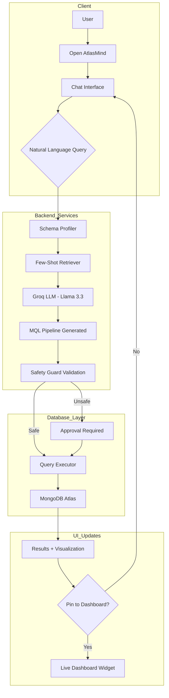
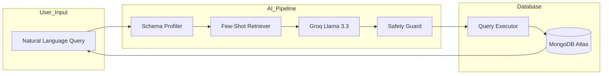

# 🏗️ Architecture & Design

AtlasMind is built with a decoupled architecture, separating the AI intelligence layer from the core data processing and visualization.

## 🧭 System Flow

## 🧠 AI Query Generation Lifecycle

The AI pipeline is designed for low latency and high accuracy by combining schema context with few-shot examples.

## 🛠️ Tech Stack

### Frontend
- **React 18** + **Vite**: Ultra-fast development and optimized production builds.
- **Tailwind CSS**: Modern styling with glassmorphism effects.
- **TanStack Query (React Query)**: Efficient state management and caching.
- **Recharts**: Responsive and interactive data visualizations.
- **Lucide React**: Premium icon set.

### Backend & AI
- **Node.js** & **Express**: Lightweight and scalable server architecture.
- **Groq LPU Acceleration**: Powering sub-200ms LLM inference.
- **Llama 3.3 70B**: State-of-the-art language model for MQL generation.
- **MongoDB Atlas**: Cloud-native document database.

## 🎨 Key Design Patterns

- **Service Layer Pattern**: Business logic (AI, Executor, Profiler) is strictly separated from API routes.
- **Chain of Responsibility**: Query validation passes through multiple "guards" before execution.
- **Strategy Pattern**: visualization strategies are dynamically selected based on query result structure.
- **Singleton Pattern**: Database connection and LLM clients are managed as internal singletons.
- **Clean Architecture**: Clear separation between UI, Services, and Data layers.

---
[⬅️ Back to README](../README.md)
