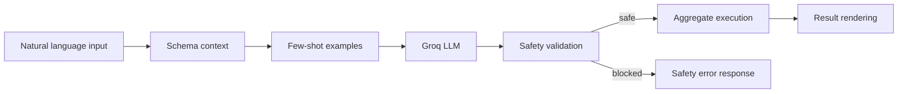

# Architecture and Design

AtlasMind is split into a React client and an Express backend, with a cookie-authenticated session layer and an AI-assisted query execution pipeline.

## System Flow

```mermaid
flowchart TD
    subgraph Client
    A[User] --> B[Landing Connect Form]
    B --> C[/api/connections/connect]
    C --> D[Session Cookie am_token]
    D --> E[Chat and Dashboard UI]
    end

    subgraph Backend
    E --> F[/api/query or /api/voice]
    F --> G[Schema Profiler]
    G --> H[Few-Shot Retriever]
    H --> I[Groq LLM llama-3.3-70b-versatile]
    I --> J[Safety Guard]
    J --> K[Query Executor]
    end

    subgraph Data
    K --> L[(User MongoDB Database)]
    K --> M[(AtlasMind Metadata DB)]
    end

    L --> N[Results and Chart]
    N --> O[/api/dashboard/pin]
```

## Query Lifecycle



Notes:

- Unsafe stages/operators are blocked and returned as safety violations.
- A limit stage is injected when none is present.
- Schema profiling excludes AtlasMind internal collections.

## Tech Stack

### Frontend

- React 19 + Vite
- Tailwind CSS + custom UI components
- TanStack Query for schema fetch caching/invalidation
- Recharts for visualization
- Axios for API access (with credentials)

### Backend and AI

- Node.js 18+ and Express 4
- MongoDB Node Driver
- Groq SDK (llama-3.3-70b-versatile + whisper-large-v3-turbo)
- JWT cookie auth + encryption for stored connection URIs
- express-rate-limit for API and auth route throttling

## Key Design Patterns

- Service layer: AI, schema, execution, and safety logic live outside routes.
- Stateless route handlers + shared infrastructure singletons.
- Guard-first execution: generated pipelines are validated before DB execution.
- Dual data context:
  - User database for analytics queries.
  - AtlasMind metadata database for saved connections, history, and dashboard pins.

---

[Back to README](../README.md)
