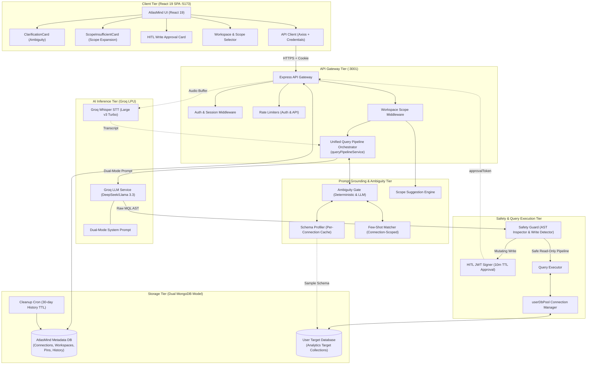
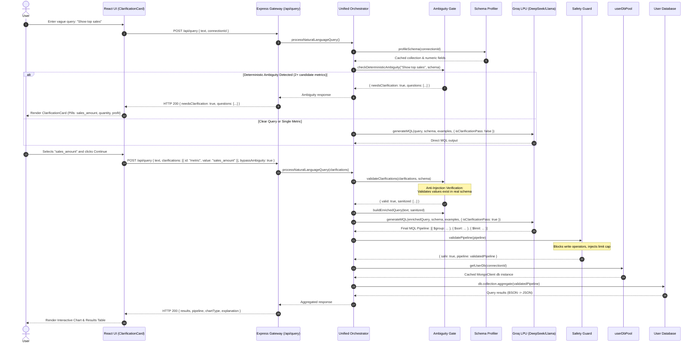
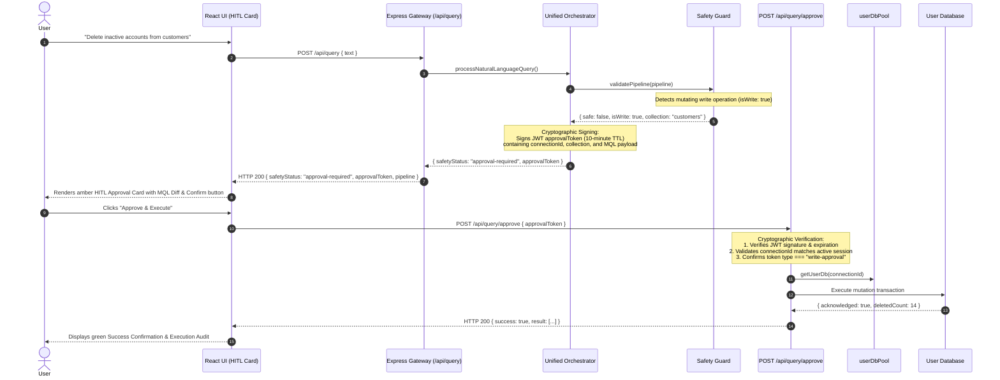
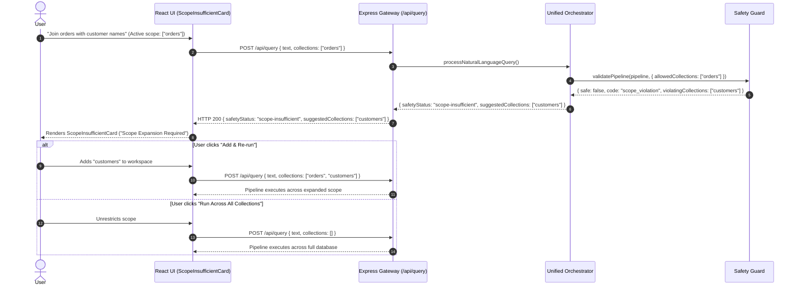

# AtlasMind Technical Architecture & Design

AtlasMind is an intelligent Natural Language to MongoDB Aggregation Pipeline (NL-to-MQL) execution platform. It transforms plain English and voice prompts into production-grade, read-only MongoDB aggregation pipelines with automated schema grounding, deterministic ambiguity detection, dynamic workspace scoping, AST safety enforcement, cryptographic Human-in-the-Loop (HITL) write verification, and isolated multi-tenant execution pools.

---

## 1. High-Level Architecture Overview

AtlasMind enforces strict separation of concerns across six distinct architectural tiers:

1. **Client Tier**: Modern React 19 SPA featuring an interactive Clarification UI (`ClarificationCard`), dynamic Scope Expansion (`ScopeInsufficientCard`), cryptographic HITL approval cards, chat streaming, chart visualizers, and workspace scope selectors.
2. **API Gateway & Routing Tier**: Express 4 server providing cookie-authenticated session management, workspace header resolution, and IP rate limiting.
3. **Prompt Grounding & Ambiguity Tier**: Per-connection schema cache profiler, deterministic & LLM ambiguity detection gate, workspace collection scoper, and connection-isolated few-shot vector retriever.
4. **AI Inference Tier**: High-throughput Groq LPU running dual-mode system prompts on DeepSeek / Llama 3.3 models alongside Whisper Large v3 Turbo audio transcription.
5. **Safety & Execution Tier**: Strict Abstract Syntax Tree (AST) pipeline validator, automatic `$limit` injection, cryptographic HITL write approval signer, and isolated `userDbPool` client connection manager.
6. **Storage Tier**: Strict physical separation between the AtlasMind Application Metadata Database (sessions, history, workspaces, dashboard pins) and external User Target Databases.

```mermaid
flowchart TD
    subgraph Client["Client Tier (React 19 SPA :5173)"]
        UI["AtlasMind UI (React 19)"]
        CC["ClarificationCard (Ambiguity)"]
        SC["ScopeInsufficientCard (Scope Expansion)"]
        AC["HITL Write Approval Card"]
        WS["Workspace & Scope Selector"]
        API_C["API Client (Axios + Credentials)"]
        UI --> CC
        UI --> SC
        UI --> AC
        UI --> WS
        UI --> API_C
    end

    subgraph Gateway["API Gateway Tier (:3001)"]
        GW["Express API Gateway"]
        AUTH["Auth & Session Middleware"]
        RL["Rate Limiters (Auth & API)"]
        WS_MW["Workspace Scope Middleware"]
        ORCH["Unified Query Pipeline Orchestrator\n(queryPipelineService)"]
        API_C -->|HTTPS + Cookie| GW
        GW --> AUTH
        GW --> RL
        GW --> WS_MW
        WS_MW --> ORCH
    end

    subgraph Grounding["Prompt Grounding & Ambiguity Tier"]
        AG["Ambiguity Gate (Deterministic & LLM)"]
        SP["Schema Profiler (Per-Connection Cache)"]
        FS["Few-Shot Matcher (Connection-Scoped)"]
        SS["Scope Suggestion Engine"]
        ORCH <--> AG
        AG <--> SP
        AG <--> FS
        WS_MW --> SS
    end

    subgraph Inference["AI Inference Tier (Groq LPU)"]
        GROQ["Groq LLM Service (DeepSeek/Llama 3.3)"]
        WHISPER["Groq Whisper STT (Large v3 Turbo)"]
        PROMPT["Dual-Mode System Prompt"]
        ORCH -->|Dual-Mode Prompt| GROQ
        GW -.->|Audio Buffer| WHISPER
        WHISPER -.->|Transcript| ORCH
        GROQ --- PROMPT
    end

    subgraph Safety["Safety & Query Execution Tier"]
        SG["Safety Guard (AST Inspector & Write Detector)"]
        HITL_SIGN["HITL JWT Signer (10m TTL Approval)"]
        QE["Query Executor"]
        POOL["userDbPool Connection Manager"]
        GROQ -->|Raw MQL AST| SG
        SG -->|Mutating Write| HITL_SIGN
        SG -->|Safe Read-Only Pipeline| QE
        HITL_SIGN -.->|approvalToken| GW
        QE <--> POOL
    end

    subgraph Storage["Storage Tier (Dual MongoDB Model)"]
        APP_DB[("AtlasMind Metadata DB\n(Connections, Workspaces, Pins, History)")]
        USER_DB[("User Target Database\n(Analytics Target Collections)")]
        CLEANUP["Cleanup Cron (30-day History TTL)"]
        GW <--> APP_DB
        CLEANUP --> APP_DB
        POOL <--> USER_DB
        SP -.->|Sample Schema| USER_DB
    end
```

---

## 2. End-to-End Query Lifecycles

### 2.1 Ambiguity Detection & Disambiguation Lifecycle

When a natural language query is submitted, AtlasMind executes an ambiguity-aware pipeline to guarantee that underspecified metrics (e.g., *"top sales"*, *"best customers"*, or *"growth"*) are never evaluated based on arbitrary LLM hallucinations.

```mermaid
sequenceDiagram
    autonumber
    actor User as User
    participant Frontend as React UI (ClarificationCard)
    participant Gateway as Express Gateway (/api/query)
    participant Orchestrator as Unified Orchestrator
    participant Ambiguity as Ambiguity Gate
    participant Schema as Schema Profiler
    participant Groq as Groq LPU (DeepSeek/Llama)
    participant Safety as Safety Guard
    participant Pool as userDbPool
    participant UserDB as User Database

    %% Pass 1: Submission
    User->>Frontend: Enter vague query: "Show top sales"
    Frontend->>Gateway: POST /api/query { text, connectionId }
    Gateway->>Orchestrator: processNaturalLanguageQuery()
    Orchestrator->>Schema: profileSchema(connectionId)
    Schema-->>Orchestrator: Cached collection & numeric fields
    Orchestrator->>Ambiguity: checkDeterministicAmbiguity("Show top sales", schema)
    
    alt Deterministic Ambiguity Detected (2+ candidate metrics)
        Ambiguity-->>Orchestrator: { needsClarification: true, questions: [...] }
        Orchestrator-->>Gateway: Ambiguity response
        Gateway-->>Frontend: HTTP 200 { needsClarification: true, questions: [...] }
        Frontend-->>User: Render ClarificationCard (Pills: sales_amount, quantity, profit)
    else Clear Query or Single Metric
        Orchestrator->>Groq: generateMQL(query, schema, examples, { isClarificationPass: false })
        Groq-->>Orchestrator: Direct MQL output
    end

    %% Pass 2: Clarification Response
    User->>Frontend: Selects "sales_amount" and clicks Continue
    Frontend->>Gateway: POST /api/query { text, clarifications: [{ id: "metric", value: "sales_amount" }], bypassAmbiguity: true }
    Gateway->>Orchestrator: processNaturalLanguageQuery(clarifications)
    Orchestrator->>Ambiguity: validateClarifications(clarifications, schema)
    Note over Ambiguity: Anti-Injection Verification:<br/>Validates values exist in real schema
    Ambiguity-->>Orchestrator: { valid: true, sanitized: [...] }
    Orchestrator->>Ambiguity: buildEnrichedQuery(text, sanitized)
    Orchestrator->>Groq: generateMQL(enrichedQuery, schema, examples, { isClarificationPass: true })
    Groq-->>Orchestrator: Final MQL Pipeline: [{ $group: ... }, { $sort: ... }, { $limit: ... }]
    
    %% Execution
    Orchestrator->>Safety: validatePipeline(pipeline)
    Note over Safety: Blocks write operators, injects limit cap
    Safety-->>Orchestrator: { safe: true, pipeline: validatedPipeline }
    Orchestrator->>Pool: getUserDb(connectionId)
    Pool-->>Orchestrator: Cached MongoClient db instance
    Orchestrator->>UserDB: db.collection.aggregate(validatedPipeline)
    UserDB-->>Orchestrator: Query results (BSON -> JSON)
    Orchestrator-->>Gateway: Aggregated response
    Gateway-->>Frontend: HTTP 200 { results, pipeline, chartType, explanation }
    Frontend-->>User: Render Interactive Chart & Results Table
```

---

### 2.2 Cryptographic Human-in-the-Loop (HITL) Write Interception Lifecycle

AtlasMind treats data modification with zero-trust rigor. Any natural language command implying a write, update, or deletion triggers a cryptographic two-phase verification process:

```mermaid
sequenceDiagram
    autonumber
    actor User as User
    participant Frontend as React UI (HITL Card)
    participant Gateway as Express Gateway (/api/query)
    participant Orchestrator as Unified Orchestrator
    participant Safety as Safety Guard
    participant ApproveRoute as POST /api/query/approve
    participant Pool as userDbPool
    participant UserDB as User Database

    User->>Frontend: "Delete inactive accounts from customers"
    Frontend->>Gateway: POST /api/query { text }
    Gateway->>Orchestrator: processNaturalLanguageQuery()
    Orchestrator->>Safety: validatePipeline(pipeline)
    Note over Safety: Detects mutating write operation (isWrite: true)
    Safety-->>Orchestrator: { safe: false, isWrite: true, collection: "customers" }
    
    Note over Orchestrator: Cryptographic Signing:<br/>Signs JWT approvalToken (10-minute TTL)<br/>containing connectionId, collection, and MQL payload
    Orchestrator-->>Gateway: { safetyStatus: "approval-required", approvalToken }
    Gateway-->>Frontend: HTTP 200 { safetyStatus: "approval-required", approvalToken, pipeline }
    Frontend-->>User: Renders amber HITL Approval Card with MQL Diff & Confirm button

    User->>Frontend: Clicks "Approve & Execute"
    Frontend->>ApproveRoute: POST /api/query/approve { approvalToken }
    Note over ApproveRoute: Cryptographic Verification:<br/>1. Verifies JWT signature & expiration<br/>2. Validates connectionId matches active session<br/>3. Confirms token type === "write-approval"
    ApproveRoute->>Pool: getUserDb(connectionId)
    ApproveRoute->>UserDB: Execute mutation transaction
    UserDB-->>ApproveRoute: { acknowledged: true, deletedCount: 14 }
    ApproveRoute-->>Frontend: HTTP 200 { success: true, result: [...] }
    Frontend-->>User: Displays green Success Confirmation & Execution Audit
```

---

### 2.3 Dynamic Scope Expansion & Fallback Protocol

When users restrict their active workspace to specific collections (e.g., `["orders"]`), queries referencing cross-collection context (e.g., *"Show orders with customer email addresses"*) are gracefully resolved via inline scope expansion:

```mermaid
sequenceDiagram
    autonumber
    actor User as User
    participant Frontend as React UI (ScopeInsufficientCard)
    participant Gateway as Express Gateway (/api/query)
    participant Orchestrator as Unified Orchestrator
    participant Safety as Safety Guard

    User->>Frontend: "Join orders with customer names" (Active scope: ["orders"])
    Frontend->>Gateway: POST /api/query { text, collections: ["orders"] }
    Gateway->>Orchestrator: processNaturalLanguageQuery()
    Orchestrator->>Safety: validatePipeline(pipeline, { allowedCollections: ["orders"] })
    Safety-->>Orchestrator: { safe: false, code: "scope_violation", violatingCollections: ["customers"] }
    Orchestrator-->>Gateway: { safetyStatus: "scope-insufficient", suggestedCollections: ["customers"] }
    Gateway-->>Frontend: HTTP 200 { safetyStatus: "scope-insufficient", suggestedCollections: ["customers"] }
    Frontend-->>User: Renders ScopeInsufficientCard ("Scope Expansion Required")
    
    alt User clicks "Add & Re-run"
        User->>Frontend: Adds "customers" to workspace
        Frontend->>Gateway: POST /api/query { text, collections: ["orders", "customers"] }
        Gateway-->>Frontend: Pipeline executes across expanded scope
    else User clicks "Run Across All Collections"
        User->>Frontend: Unrestricts scope
        Frontend->>Gateway: POST /api/query { text, collections: [] }
        Gateway-->>Frontend: Pipeline executes across full database
    end
```

---

## 3. Subsystem Breakdown & Implementation Details

### 3.1 Unified Query Pipeline Orchestrator (`server/src/services/queryPipelineService.js`)
The central transaction coordinator for AtlasMind:
- **Single Ingestion Gateway**: Powers both `POST /api/query` and `POST /api/voice`, guaranteeing exact parity in validation, scoping, prompt enrichment, safety checks, and history logging.
- **Phased Pipeline Stages**:
  1. Connection pool acquisition (`userDbPool`).
  2. Workspace collection scope resolution and schema filtering.
  3. Parallel schema profiling (`schemaProfiler`) and isolated few-shot example lookup (`fewShotRetriever`).
  4. Ambiguity Gate deterministic check and prompt enrichment.
  5. Groq LPU dual-mode LLM generation.
  6. Scope insufficiency and missing collection interception.
  7. AST safety validation and write interception.
  8. MongoDB aggregation execution with timeout cap.
  9. Telemetry recording and persistent query history save.

### 3.2 Ambiguity Gate Service (`server/src/services/ambiguityGate.js`)
Protects against hallucinated business logic:
- **Deterministic Check**: Evaluates vague terms against a curated dictionary (`top`, `best`, `highest`, `lowest`, `recent`, `growth`, `popular`, etc.). Clarification triggers immediately if two or more numeric field candidates exist across active collections.
- **Anti-Injection Validator (`validateClarifications`)**: Ensures clarification choices from the client match real schema fields. Discards hallucinated or malicious string injections.
- **Telemetry Observability Engine**: Records granular events (`ambiguity_asked`, `ambiguity_skipped`, `ambiguity_resolved`, `ambiguity_bypassed`, `clarification_edit`) to calculate empirical KPIs (Ask Rate, Resolution Rate, Edit-after-Result Rate).

### 3.3 Cryptographic Human-in-the-Loop Write Guard (`server/src/routes/query.js`)
- **Mutating Write Interception**: Inspects collection names and aggregation stages. Any pipeline containing `$out`, `$merge`, or collection mutating commands (`deleteMany`, `updateMany`, `insertOne`) is intercepted.
- **Signed Approval Tokens**: Generates an HMAC-SHA256 signed JWT (`approvalToken`) with a 10-minute expiration containing the exact payload and tenant scope.
- **Verification Endpoint (`POST /api/query/approve`)**: Safely executes write commands only upon presentation of a valid, unexpired token matching the active session's `connectionId`.

### 3.4 Dynamic Workspace Scoping & Suggestion (`server/src/routes/workspaces.js`, `server/src/routes/scopeSuggest.js`)
- **Workspace Scoping**: Restricts query context to curated collection subsets, reducing LLM prompt size and preventing cross-domain confusion.
- **Scope Insufficient Handling**: When an MQL pipeline requires unselected collections, the system returns `safetyStatus: 'scope-insufficient'` and prompts users via `ScopeInsufficientCard`.
- **Dynamic Scope Discovery (`scopeSuggest.js`)**: Uses semantic clustering to recommend optimal workspace groupings (e.g., *Billing & Invoices*, *User Engagement*, *Catalog & Inventory*).

### 3.5 Schema Profiler & Isolated Caching (`server/src/services/schemaProfiler.js`)
- **Per-Connection Caching**: Caches schema definitions keyed by `connectionId || db.databaseName` with a 5-minute TTL.
- **Document Sampling**: Inspects up to 10 representative documents per collection to infer data types and nested fields without full collection scans.
- **Internal Collection Exclusion**: Excludes system collections (`system.*`) and AtlasMind metadata collections (`connections`, `dashboards`, `query_history`, `workspaces`, `few_shot_examples`).

### 3.6 Connection-Isolated Few-Shot Retriever (`server/src/services/fewShotRetriever.js`)
- **Hybrid Search**: Combines Atlas Vector Search (cosine similarity) with text regex fallbacks.
- **Strict Tenant Isolation**: All retrievals enforce `{ connectionId }` filtering. No query example from Database A is ever exposed to Database B.

### 3.7 Dual-Mode AI Inference Engine (`server/src/services/groqService.js`)
- **Two-Mode Prompting**:
  - *Pass 1 (Exploration)*: Model may return `{ needsClarification: true, questions: [...] }` or final MQL.
  - *Pass 2 (Execution)*: Clarification mode is disabled; model must output a valid MQL pipeline.
- **Multimodal STT (Whisper Large v3 Turbo)**: Transcribes audio buffers from `POST /api/voice` and routes transcripts directly into the unified orchestrator.

### 3.8 AST Safety Guard (`server/src/services/safetyGuard.js`)
- Rejects destructive stages: `$out`, `$merge`, `$writeConcern`, `$collStats`.
- Automatic limit clamping: Appends a `$limit: 100` stage if omitted by the LLM.

### 3.9 Connection Pool Manager (`server/src/services/userDbPool.js`)
- Maintains an LRU cache of `MongoClient` instances mapped by encrypted `connectionId`.
- Features connection reuse, pool caps (`maxPoolSize: 10`), and idle connection eviction (`maxIdleTimeMS: 30000`).

### 3.10 Storage Separation & Retention Service (`server/src/services/cleanupService.js`)
- Dual database model: Application metadata and user analytics databases are physically decoupled.
- Background cron runs daily to purge transient playground history older than 30 days. Pinned widgets and verified few-shot examples are permanently retained.

---

## 4. Component Matrix

| Layer | Component | Implementation | Primary Responsibility |
|---|---|---|---|
| **Frontend** | Application Shell | React 19, Vite, Tailwind CSS | UI orchestration, state management, layout |
| **Frontend** | Clarification Card | `ClarificationCard.jsx` | Disambiguation pills, custom metric inputs |
| **Frontend** | Scope Insufficient Card | `ScopeInsufficientCard.jsx` | Scope expansion prompts and re-runs |
| **Frontend** | HITL Approval Card | `AtlasChatPanel.jsx` | 2-step write verification modal |
| **Frontend** | Workspace Selector | `ScopeWorkspaceSelector.jsx` | Active collection scoping & switching |
| **Frontend** | Visualizations | Recharts (`ChartRenderer.jsx`) | Interactive Bar, Line, Area, Pie, Radar charts |
| **Frontend** | Voice Input | `VoiceButton.jsx`, `VoiceInputBar.jsx` | MediaRecorder WebM audio streaming |
| **Backend** | Query Orchestrator | `queryPipelineService.js` | Unified lifecycle coordination |
| **Backend** | Ambiguity Gate | `ambiguityGate.js` | Deterministic checks, prompt injection defense |
| **Backend** | Schema Profiler | `schemaProfiler.js` | Per-connection schema cache and document sampler |
| **Backend** | Few-Shot Matcher | `fewShotRetriever.js` | Connection-isolated vector memory |
| **Backend** | Safety Guard | `safetyGuard.js` | AST inspection, write detection, limit cap |
| **Backend** | AI & STT | `groqService.js` | DeepSeek/Llama 3.3 MQL & Whisper transcription |
| **Backend** | Connection Pool | `userDbPool.js` | Dynamic MongoClient pooling & LRU eviction |
| **Backend** | Auto-Cleaner | `cleanupService.js` | 30-day playground history TTL cron |

---

## 5. Security & Isolation Guarantees

1. **Zero Data Co-mingling**: User analytics databases are never co-located with AtlasMind application metadata.
2. **Cryptographic HITL Write Approval**: Destructive actions cannot execute without a signed, 10-minute JWT approved by the user.
3. **Tenant-Isolated Prompt Context**: Schema caches and few-shot memories are strictly isolated by `connectionId`.
4. **Anti-Injection Schema Whitelisting**: User inputs in clarification cards are validated against live schema ASTs before LLM prompt injection.
5. **AST Guard-First Execution**: Aggregation pipelines are parsed as JSON ASTs and vetted before execution against MongoDB driver instances.

---

*For detailed API contracts and endpoint payloads, see [API Documentation](./API.md).*
*For empirical benchmark metrics and regression evaluation, see [Ambiguity Research Report](./AMBIGUITY_RESEARCH_EVALUATION.md).*
